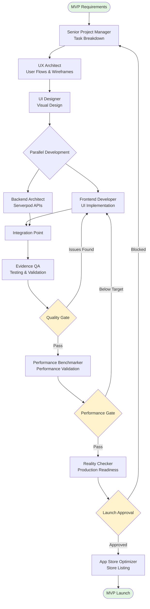
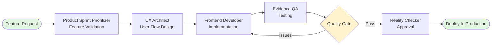
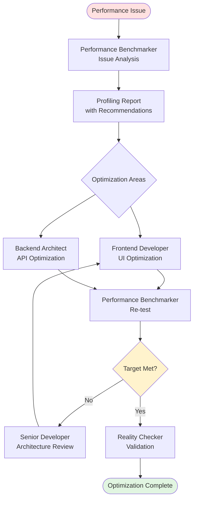
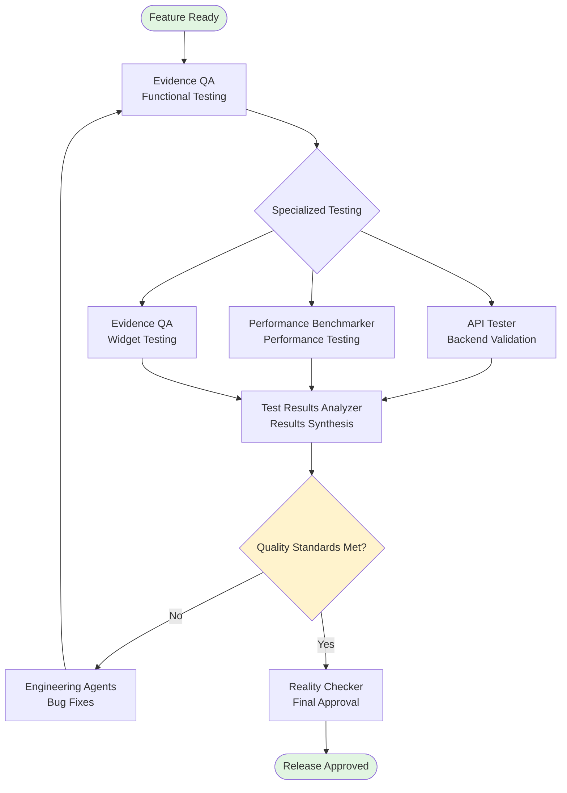
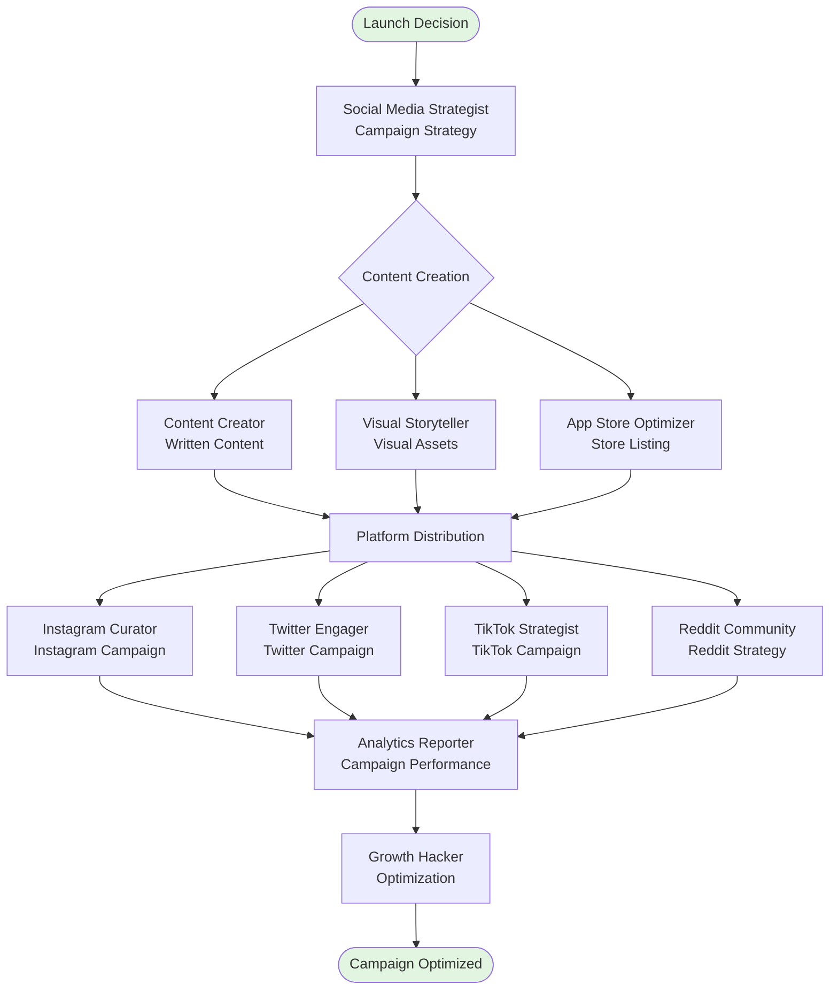

# Flutter Agency Agents - Workflow Orchestration Guide

**📊 Visual Agent Coordination Patterns | Version 1.0.0 | Updated: Oct 17, 2025**

---

## 📖 Introduction

This guide provides pre-defined agent workflows for common Flutter development scenarios. Each workflow includes:
- **Mermaid Diagram**: Visual representation of agent sequence and handoffs
- **Handoff Checklist**: Deliverables required at each transition
- **Timeline Estimate**: Typical duration for workflow completion
- **Success Criteria**: Quality gates and validation requirements

### How to Read Workflow Diagrams

- **Rectangles**: Individual agents performing tasks
- **Diamonds**: Decision/validation gates (go/no-go points)
- **Arrows**: Handoffs and information flow
- **Parallel Paths**: Tasks executed simultaneously
- **Swim Lanes**: Organization by division (Engineering, Testing, Design, etc.)

### When to Use These Workflows

- **MVP Development**: Building full product from scratch in 2 weeks
- **Feature Development**: Adding new feature to existing app in 1 week sprint
- **Performance Optimization**: Diagnosing and fixing performance issues
- **Testing & Validation**: Comprehensive QA before release
- **Marketing Campaign**: Launching app or promoting major feature

---

## 🚀 Workflow 1: MVP Development (2-Week Timeline)

### Agent Sequence



### Handoff Checklist

**PM → UX Architect**
- [ ] Feature requirements document with SMART acceptance criteria
- [ ] User stories with priority levels
- [ ] Technical constraints and platform targets
- [ ] Timeline and sprint schedule

**UX Architect → UI Designer**
- [ ] Wireframes for all screens and states (loading, success, error, empty)
- [ ] User flow diagrams with all paths
- [ ] Interaction specifications
- [ ] Navigation architecture

**UI Designer → Engineering (Frontend + Backend)**
- [ ] High-fidelity designs with design system specs
- [ ] Component specifications with measurements
- [ ] Asset files (icons, images, fonts)
- [ ] Platform-specific adaptations (Material/Cupertino)

**Engineering → Evidence QA**
- [ ] Implemented features on staging environment
- [ ] Unit tests (>80% coverage for business logic)
- [ ] Known issues list
- [ ] Test account credentials

**Evidence QA → Performance Benchmarker**
- [ ] QA approval with test results
- [ ] Bug reports (all critical/blocker bugs fixed)
- [ ] Regression test results
- [ ] Device compatibility matrix

**Performance Benchmarker → Reality Checker**
- [ ] Performance metrics (60fps, <2s startup, <150MB memory)
- [ ] Profiling reports from Flutter DevTools
- [ ] Optimization recommendations (if needed)
- [ ] Performance approval

**Reality Checker → App Store Optimizer**
- [ ] Production approval
- [ ] flutter analyze clean report
- [ ] All quality gates passed
- [ ] Deployment-ready build

**App Store Optimizer → Launch**
- [ ] App Store listing optimized (title, description, keywords)
- [ ] Screenshots and preview video
- [ ] Privacy policy and app metadata
- [ ] Submission ready

### Timeline Estimate

- **Days 1-2**: PM task breakdown, UX wireframes
- **Days 3-4**: UI design, design system setup
- **Days 5-10**: Parallel frontend + backend development
- **Days 11-12**: Integration, testing, bug fixes
- **Day 13**: Performance optimization
- **Day 14**: Final validation, App Store prep, launch

### Success Criteria

- ✅ All core features functional
- ✅ Zero critical bugs
- ✅ Performance targets met (60fps, <2s startup)
- ✅ Test coverage >80% for business logic
- ✅ App Store listing complete
- ✅ Ready for production deployment

---

## 🔧 Workflow 2: Feature Development (1-Week Sprint)

### Agent Sequence



### Handoff Checklist

**Product Sprint Prioritizer → UX Architect**
- [ ] Feature prioritization rationale
- [ ] User value assessment
- [ ] Effort estimate
- [ ] Sprint commitment

**UX Architect → Frontend Developer**
- [ ] User flow with all states
- [ ] Wireframes annotated with interactions
- [ ] Acceptance criteria
- [ ] Navigation integration points

**Frontend Developer → Evidence QA**
- [ ] Feature implementation complete
- [ ] Unit tests for cubit (using bloc_test)
- [ ] Widget tests for screen
- [ ] Local testing results

**Evidence QA → Reality Checker**
- [ ] Test results (unit, widget, integration)
- [ ] Bug report (all fixed)
- [ ] Screenshot evidence
- [ ] Test coverage report

**Reality Checker → Deployment**
- [ ] Production approval
- [ ] All quality gates passed
- [ ] Documentation updated
- [ ] Release notes prepared

### Timeline Estimate

- **Day 1**: Prioritization, UX design
- **Days 2-4**: Frontend implementation with tests
- **Day 5**: QA testing, bug fixes
- **Day 5 (PM)**: Final validation, deploy

### Success Criteria

- ✅ Feature meets all acceptance criteria
- ✅ No regression bugs introduced
- ✅ Test coverage >80%
- ✅ Performance impact minimal (<5% degradation)
- ✅ Passes Reality Checker approval

---

## ⚡ Workflow 3: Performance Optimization (2-3 Days)

### Agent Sequence



### Handoff Checklist

**Performance Benchmarker → Engineering**
- [ ] Profiling report with Flutter DevTools timeline
- [ ] Performance bottlenecks identified
- [ ] Optimization recommendations prioritized
- [ ] Target metrics defined (60fps, <2s startup, <150MB memory)

**Engineering → Performance Benchmarker (Re-test)**
- [ ] Optimization implementations complete
- [ ] Before/after performance comparison
- [ ] Code changes documented
- [ ] No regression bugs introduced

**Performance Benchmarker → Reality Checker**
- [ ] Performance targets achieved
- [ ] Benchmark comparison (before/after)
- [ ] No quality degradation
- [ ] Optimization sustainable (not hacks)

### Timeline Estimate

- **Day 1 AM**: Profiling and analysis
- **Day 1 PM - Day 2**: Optimization implementation
- **Day 3**: Re-testing and validation

### Success Criteria

- ✅ 60fps maintained during scrolling/animations
- ✅ App startup <2s (cold), <1s (warm)
- ✅ Memory usage <150MB
- ✅ No new bugs introduced
- ✅ User-perceivable improvement

---

## 🧪 Workflow 4: Testing & Validation (3-5 Days)

### Agent Sequence



### Handoff Checklist

**Evidence QA → Specialized Testers**
- [ ] Feature implementation complete
- [ ] Test environments configured
- [ ] Test account credentials
- [ ] Known issues documented

**Specialized Testers → Test Results Analyzer**
- [ ] API test results (all endpoints validated)
- [ ] Performance benchmarks (metrics captured)
- [ ] Widget test results (UI validation)
- [ ] Bug reports for any issues found

**Test Results Analyzer → Reality Checker**
- [ ] Comprehensive test report
- [ ] All critical/blocker bugs fixed
- [ ] Test coverage >80%
- [ ] Quality metrics dashboard

**Reality Checker → Release**
- [ ] All quality gates passed
- [ ] flutter analyze clean
- [ ] Performance targets met
- [ ] Production approval granted

### Timeline Estimate

- **Day 1**: Functional testing (Evidence QA)
- **Days 2-3**: Specialized testing (API, Performance, Widget)
- **Day 4**: Bug fixes, re-testing
- **Day 5**: Final analysis and approval

### Success Criteria

- ✅ Zero critical bugs
- ✅ All acceptance criteria met
- ✅ Test coverage >80%
- ✅ Performance targets achieved
- ✅ Reality Checker approval obtained

---

## 📢 Workflow 5: Marketing Campaign (1-2 Weeks)

### Agent Sequence



### Handoff Checklist

**Social Media Strategist → Content Creation Team**
- [ ] Campaign objectives and key messages
- [ ] Platform-specific strategies
- [ ] Content calendar with posting schedule
- [ ] Brand guidelines and messaging framework

**Content Creation Team → Platform Agents**
- [ ] Written content (captions, descriptions, blog posts)
- [ ] Visual assets (images, videos, graphics)
- [ ] App Store listing (optimized for ASO)
- [ ] Platform-specific content adaptations

**Platform Agents → Analytics Reporter**
- [ ] Campaign execution status
- [ ] Engagement metrics (likes, shares, comments)
- [ ] Reach and impressions data
- [ ] Conversion tracking setup

**Analytics Reporter → Growth Hacker**
- [ ] Campaign performance report
- [ ] Top-performing content analysis
- [ ] Audience behavior insights
- [ ] Optimization opportunities identified

### Timeline Estimate

- **Week 1 Days 1-2**: Strategy and content creation
- **Week 1 Days 3-7**: Platform execution begins
- **Week 2**: Monitoring, optimization, scaling winners

### Success Criteria

- ✅ Campaign launched on schedule across all platforms
- ✅ Engagement rate >5% (Instagram), >2% (Twitter), >8% (TikTok)
- ✅ App installs increased >30% during campaign
- ✅ Brand awareness metrics improved >25%
- ✅ Campaign ROI >3:1

---

## 📋 Appendix: Workflow Patterns

### Sequential vs Parallel Execution

**Sequential (One After Another)**
```
PM → UX → Frontend → QA → Reality Checker
```
- Use when: Later agents need complete output from previous agents
- Example: Can't test (QA) until implementation (Frontend) is complete

**Parallel (Simultaneously)**
```
       ┌→ Frontend Developer
UX → ──┤
       └→ Backend Architect
```
- Use when: Agents work on independent aspects
- Example: Frontend and Backend can develop simultaneously after UX specs

### Quality Gates (Decision Points)

**Types of Gates**:
1. **Quality Gate**: Evidence QA approval required
2. **Performance Gate**: Performance targets must be met
3. **Production Gate**: Reality Checker final approval
4. **Business Gate**: PM/Product approval for launch

**Gate Criteria**:
- Clear pass/fail criteria
- Documented validation procedure
- Designated approver
- Escalation path for failures

### Emergency Workflows

**Critical Bug Fix (Same-Day)**
```
Evidence QA (bug report) → Frontend/Backend (fix) → Evidence QA (validation) → Reality Checker (approval) → Deploy
```

**Performance Crisis**
```
Performance Benchmarker (issue) → Senior Developer (analysis) → Engineering Team (fix) → Performance Benchmarker (validation) → Deploy
```

**Security Issue**
```
Legal Compliance (alert) → Backend Architect (patch) → API Tester (validation) → Reality Checker (approval) → Emergency Deploy
```

---

## 🔄 Workflow Customization

### Adapting Workflows to Your Project

1. **Identify Core Path**: What's the minimum agent sequence for your goal?
2. **Add Specialists**: Include specialized agents as needed (AI Engineer, Growth Hacker)
3. **Define Gates**: Set quality/performance gates appropriate for your standards
4. **Set Timelines**: Adjust durations based on team size and feature complexity
5. **Document Handoffs**: Specify exactly what each agent provides to the next

### Example Customization

**Original**: MVP Development (2 weeks)
**Customized**: MVP with AI Features (3 weeks)

**Added Agents**:
- AI Engineer (after Backend Architect, before Integration)
- Additional testing for ML model validation

**Extended Timeline**:
- +1 week for ML model training and integration
- Additional performance validation for ML inference

---

## 📚 Related Resources

- **[USAGE_GUIDE.md](./USAGE_GUIDE.md)**: How to work with agents effectively
- **[QUICK_REFERENCE.md](./QUICK_REFERENCE.md)**: Agent selector cheat sheet
- **[TESTING_VALIDATION_GUIDE.md](./TESTING_VALIDATION_GUIDE.md)**: Quality assurance procedures
- **Agent Files**: See individual agent handoffs in each agent's markdown file

---

## 🎯 Workflow Selection Guide

| **Your Goal** | **Use Workflow** | **Agent Count** | **Timeline** |
|--------------|------------------|-----------------|--------------|
| Build complete MVP from scratch | Workflow 1: MVP Development | 7 agents | 2 weeks |
| Add new feature to existing app | Workflow 2: Feature Development | 5 agents | 1 week |
| Fix performance problems | Workflow 3: Performance Optimization | 4 agents | 2-3 days |
| Comprehensive QA before release | Workflow 4: Testing & Validation | 6 agents | 3-5 days |
| Launch marketing campaign | Workflow 5: Marketing Campaign | 5-8 agents | 1-2 weeks |
| Critical bug fix | Emergency: Bug Fix | 3 agents | Same day |
| Security vulnerability | Emergency: Security Patch | 4 agents | Same day |

---

**Version**: 1.0.0 | **Last Updated**: October 17, 2025 | **Workflows**: 5 Core + 3 Emergency

